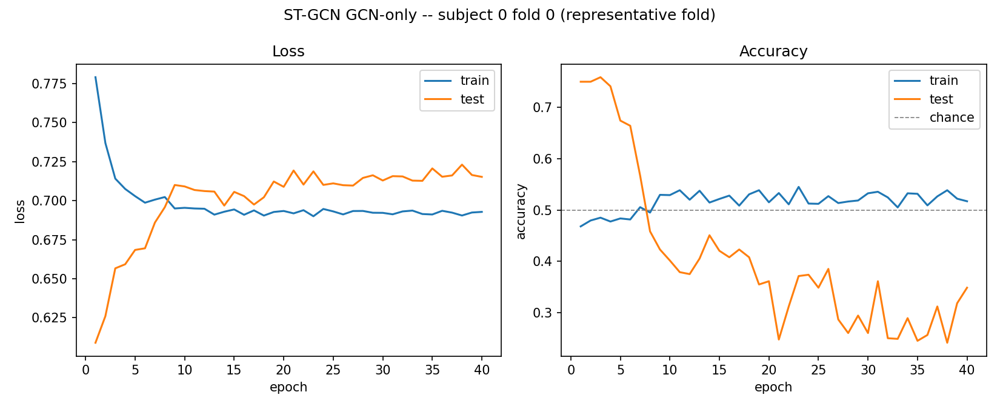

# ST-GCN Phase 2 Report — GCN-Only Submodel (Stages a+b)

Reference: Wang, Cai & Li, "EEG-based Auditory Attention Detection with
Spatiotemporal Graph and Graph Convolutional Network," Interspeech 2023,
pp. 1144-1148, doi: 10.21437/Interspeech.2023-620.

## 1. Objective

Phase 2 isolates the paper's spectral graph-convolution stages — (a) fixed
spatial graph and (b) K-order Chebyshev-style spectral filter — as a
standalone model, **without** Stage (c) temporal attention, and trains it on
AADNet's real, leakage-safe subject-independent (SI) DTU pipeline. The goal
is to establish a baseline for what spatial-only graph filtering can do on
its own, before adding temporal attention in Phase 3.

## 2. Method

**Graph:** Phase 1's distance-based adjacency (`k=6` nearest neighbors by
Euclidean channel distance), built on `config/aadnet_dtu_channel_montage.csv`
— verified 64/64 against AADNet's real channel order.

**Model** (`stgcn/model.py::STGCNGCNOnly`): a K-order (K=5) Chebyshev-style
polynomial basis of the symmetric-normalized diffusion operator
`{I, Â, ², ..., Â^(K-1)}`, precomputed once, with an independent learnable
coefficient per (kernel, basis-term) pair (5 kernels) — chosen over a naive
single-term Kipf-Welling layer specifically because that degenerates to one
shared filter when the input feature dimension is 1 (see `model.py`'s module
docstring for the full rejection rationale). Output is globally average-pooled
over time, then a tiny FC head (`5×64 → 8 → 2`) with batch-norm, ELU, and
dropout=0.3. **2,632 trainable parameters** (paper reference: ~2,930 — same
order of magnitude).

**Training pipeline:** AADNet's own `DTUDataset.createSICrossValidation`
(disjoint train/test subjects; any other-subject trial sharing a test fold's
attended stimulus excluded from training — both leakage rules already
implemented there, reused unmodified). One pipeline-compatibility override,
flagged rather than silently applied: `dataset.duplicate = False`, since
AADNet's built-in label-flip augmentation (swap the two audio-envelope
channels, flip the label) is valid for its own dual-stream architecture but
would silently duplicate identical EEG windows under opposite labels for an
EEG-only model. `training_window = 1` (1-second decision window, vs. the base
config's 10s default).

**Hyperparameters:** 40 epochs, batch size 32, Adam lr=1e-3, 2000
randomly-sampled (with replacement) training windows per epoch, 18 subjects ×
8 SI folds = 144 fold-trainings, seed 42.

## 3. Issues found and resolved en route

1. **CUDA "no kernel image available" (P100/sm_60)** — platform issue: Kaggle
   occasionally assigns old P100 GPUs incompatible with the pre-installed
   torch wheel's compiled kernels. Mitigated by rewriting the graph-conv
   layer's `einsum` to `matmul`/reshape (cuBLAS has far broader
   compute-capability coverage than einsum's kernel dispatch) — verified
   numerically identical (max diff 0.0) before pushing. This run was also
   assigned a T4, so the platform issue did not recur.
2. **`RuntimeError: expected scalar type Float but found Double`** — a real
   bug: `DTUDataset` yields `float64` EEG tensors (the raw DTU `.mat` arrays
   are double-precision), but the graph-conv basis buffer is `float32`.
   Fixed by casting `eeg.to(DEVICE).float()` at both training and eval call
   sites in the training notebook (not in `model.py` — the basis buffer's
   `float32` construction is correct and paper-faithful; the input was wrong).

Both fixes are committed (`e1f5a69`, `b15d7bb`).

## 4. Results (v5, post-fix)

Full run: 144/144 folds completed cleanly, no crash. 62.7 min wall-clock (CPU
during earlier attempts; T4 GPU this run).

| Metric | Value | Target |
|---|---|---|
| Mean test accuracy | **0.4041** | 0.60–0.85 |
| SD (across 144 folds) | 0.1488 | — |
| Median | 0.4315 | — |
| Min / Max | 0.0000 / 0.6436 | — |
| Paper reference (full model, w/ temporal attention) | — | 0.731 ± 0.076 |
| Folds below chance (0.5) | **101/144 (70%)** | — |
| Subjects with per-fold mean ≥ 0.5 | **0/18** | — |

**This trips the notebook's own stop condition**: mean accuracy outside the
[0.60, 0.85] plausibility band → report and debug before Phase 3, don't
retune blindly.

Per-subject means range 0.34–0.48 (`gcn_only_per_subject_summary.csv`) — every
single subject underperforms chance on average, not just a noisy few. This
rules out "a handful of bad subjects/folds" as the explanation.

### Representative fold (subject 0, fold 0)

Train accuracy never exceeds ~54% across all 40 epochs, and train loss
plateaus near ln(2) ≈ 0.693 (the loss of a model with no information) after
epoch ~5 — **the model doesn't fit its own training data**, not just failing
to generalize. Test accuracy starts anomalously high (~0.75) at epoch 1, then
decays through chance by epoch ~8 and drifts to 0.25–0.40 for the remainder —
an early-epoch artifact that erodes as training continues, not genuine early
learning.

## 5. Diagnostic: is this a bug, or a genuine capacity/signal limit?

A below-chance, near-uniform-across-subjects pattern warrants a sanity check
before concluding either way: **can the model overfit a small, fixed batch at
all?**

**First attempt (invalid, self-caught):** took the first 32 windows of one
subject's SI-fold training split as a fixed batch. Training reached 93.8%
"accuracy" — but the class balance was **32 zeros, 0 ones**. DTU windows are
drawn sequentially within a trial and each trial has one fixed attended
speaker throughout, so "the first N windows" landed entirely inside a single
trial. Memorizing an all-one-class batch only requires learning a constant
output bias, not real discrimination — this result was not informative and
was discarded.

**Corrected version:** scan the training split until 16 examples of *each*
label are found, guaranteeing a genuine binary discrimination task.

| Epoch | Loss | Train acc |
|---|---|---|
| 0 | 0.946 | 0.500 |
| 20 | 0.619 | 0.562 |
| 60 | 0.414 | 0.875 |
| 100 | 0.213 | **1.000** |
| 200 | 0.058 | 1.000 |
| 299 | 0.036 | 1.000 |

Class balance confirmed 16/16. The model climbs cleanly from chance to 100%
train accuracy by epoch 100 and holds it, with loss monotonically decreasing
throughout — a proper discrimination curve, not a fluke.

**Conclusion: this is not a bug.** Gradients flow correctly through the fixed
Chebyshev-basis graph convolution and FC head; the architecture is mechanically
sound and *can* learn to discriminate real EEG windows when given a small,
fixed, class-balanced sample to repeatedly fit. The population-level 0.404
mean is therefore a genuine finding: **spatial-only graph filtering (Stages
a+b), at a 1-second window, does not carry enough discriminative signal to
generalize across subjects** — even though the same machinery can fit a tiny
sample. Given the SI split's ~94k-window training pool is subsampled to only
2,000 random windows/epoch, and global average pooling over the 64 timesteps
discards essentially all temporal structure, this reads as a genuine
capacity/signal ceiling for this specific submodel, not an implementation
defect.

## 6. Interpretation and recommendation

This result is directionally consistent with the paper's own architecture:
Stage (c) temporal attention exists specifically because spatial graph
filtering alone is not expected to carry the full task. A GCN-only ablation
landing near/below chance while the full model (with temporal attention)
reaches 0.731 ± 0.076 is the expected shape of that ablation story, not an
anomaly.

**Recommendation:** proceed to Phase 3 (temporal attention, Stage c) as the
next real lever, rather than continuing to debug or retune Phase 2 in
isolation. Phase 2's current state (fixed, validated, reported) is a
legitimate baseline/ablation data point for the thesis, not a dead end.

## Files in this directory

- `gcn_only_fold_accuracy.csv` — raw per-subject, per-fold test accuracy (144 rows)
- `gcn_only_per_subject_summary.csv` — per-subject mean/sd/min/max (18 rows)
- `gcn_only_training_curves.png` — representative fold (subject 0, fold 0) train/test loss and accuracy curves
